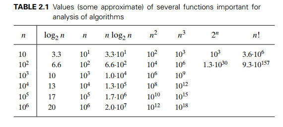
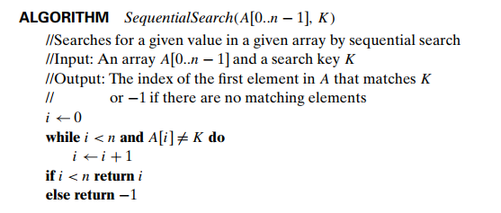

```
Module-1:
    1. Introduction:
        ○ Chapter 1:
            § Section 1.1: What is an Algorithm?
            § Section 1.2: Fundamentals of Algorithmic Problem Solving
    2. Fundamentals of the Analysis of Algorithm Efficiency:
        ○ Chapter 2:
            § Section 2.1: Analysis Framework
            § Section 2.2: Asymptotic Notations and Basic Efficiency Classes
            § Section 2.3: Mathematical Analysis of Non-recursive Algorithms
            § Section 2.4: Mathematical Analysis of Recursive Algorithms
    3. Brute Force Approaches:
        ○ Chapter 3:
            § Section 3.1: Selection Sort and Bubble Sort
            § Section 3.2: Sequential Search
            § Section 3.3: Brute Force String Matching
```
---
# Section 2.1: Analysis Framework
---
**1. Efficiency:** When we talk about efficiency in computer algorithms, we usually mean two things: time efficiency and space efficiency.

- **Time Efficiency:** This tells us how fast an algorithm runs.
- **Space Efficiency:** This tells us how much memory an algorithm needs.

**2. Why it matters:** Back in the early days of computing, both time and space were really important because computers were slower and had less memory. But now, computers are much faster and have way more memory. So, we don't worry as much about extra space, although there are still differences between fast memory, slow memory, and cache. Time, however, is still a big deal.

---
#### Measuring an input's size
---
**1. Measuring Input Size:** Most algorithms take longer to run on bigger inputs. So, we often measure an algorithm's efficiency based on some parameter that represents the size of its input.

- For example, if we're sorting a list, the size parameter might be the number of items in the list.
- Or, if we're working with polynomials, the size parameter might be the degree of the polynomial.

**2. Choosing the Right Size Metric:** Sometimes, picking the right parameter to represent input size matters. For example, if we're multiplying matrices, we could measure the size by the order of the matrices (like n by n) or by the total number of elements in the matrices. Depending on which one we choose, we might get different answers about the efficiency of our algorithm.

**3. Special Cases:** Sometimes, the way we measure input size depends on what the algorithm does.

- For example, if we're checking spelling, we might measure input size by the number of characters if the algorithm looks at individual letters, or by the number of words if it works with whole words.
    
- And for problems like checking if a number is prime, where the input is just one number, we usually measure the size by the number of bits in its binary representation. This gives us a better idea of how efficient the algorithm is.
---
#### Units for Measuring Running Time
---
**1. Measuring Running Time:** When we want to measure how fast an algorithm runs, using standard units like seconds or milliseconds isn't ideal. That's because it depends on the computer's speed, the quality of the program, and other factors. So, we need a way to measure running time that doesn't depend on these things.

**2. Basic Operation:** The key idea is to find the most important operation in the algorithm, called the "basic operation." This is usually the operation that takes up the most time, especially inside loops. For example, in sorting algorithms, it's often comparing elements. In math algorithms, it's usually division, then multiplication, and so on.

**3. Counting Basic Operations:** We count how many times this basic operation happens for a given input size nn. This helps us understand the algorithm's efficiency.

**4. Estimating Running Time:** We can estimate how long the algorithm will take to run on a particular computer by multiplying the time it takes to do one basic operation ($c_{op}$) by the number of times the basic operation is executed $C(n)$. So, $T(n)$, the total running time, is approximately $$c_{op}×C(n)$$
**5. Applying the Formula:** For example, if $$C(n)=\frac{1}{2}n(n−1)$$ and we want to know how much longer the algorithm will take if we double the input size (n becomes 2n), we can use the formula. We find that $$\frac{T(2n)}{T(n)}$$​ is approximately 4, which means it will take about four times longer. We don't even need to know the exact value of $c_{op}$ it cancels out in the ratio.

**6. Ignoring Constants:** We often ignore constants like $c_{op}$ and $\frac{1}{2}$ in $$C(n) = \frac{1}{2} n(n-1)$$ This is because they don't affect the growth rate of the algorithm for large inputs. We're more interested in how the count changes as n gets bigger, rather than the exact numbers.

So, in a nutshell, this approach helps us understand how the algorithm's efficiency changes as the input size grows. It's a way to compare algorithms and predict their performance without worrying too much about specific computer speeds or program quality.

---
#### Orders of Growth
---
**1. Orders of Growth:** We're interested in how algorithms perform as the input size grows large. When we're dealing with small inputs, the difference in running times between efficient and inefficient algorithms might not be very noticeable or important.

**2. Focus on Large Inputs:** The real distinction between efficient and inefficient algorithms becomes clear and important when we deal with large inputs. That's when we care about the order of growth of a function.



**3. Table of Functions:** In Table 2.1, we see different functions and how they grow as the input size increases. The slowest-growing function is logarithmic, which grows so slowly that even for large inputs, algorithms based on it run super fast.

**4. Logarithmic Function:** Logarithmic functions grow very slowly, almost like they're instant for realistic input sizes. We often omit the base of the logarithm because changing the base just changes the constant, not the order of growth.

**5. Exponential and Factorial Functions:** On the other hand, exponential (like 2n) and factorial (n!) functions grow super fast. Even for small inputs, their values become huge. Algorithms that require an exponential number of operations are only practical for tiny problems.

**6. Reacting to Input Changes:** When we double the input size:

- Logarithmic functions increase just by 1.
- Linear functions double.
- Linearithmic functions (like $nlog⁡(n)$) increase slightly more than double.
- Quadratic and cubic functions (like n2 and n3) increase fourfold and eightfold, respectively.
- Exponential functions (2n) get squared.
- Factorial functions (n!) increase even more dramatically.

In summary, how algorithms grow in relation to input size is crucial for understanding their efficiency, especially as inputs get larger.

---
#### Worst-Case, Best-Case, and Average-Case Efficiencies
---
In many algorithms running time depends not only on an input size but also on the specifics of a particular input.
###### Ex. Sequential Search
---


---
**1. Worst-Case Efficiency:**

- This measures how long an algorithm takes to run in the scenario where it performs the worst.
- For example, imagine a search algorithm that has to look through a list to find an item. In the worst-case scenario, the item isn't in the list or it's at the very end. So, the algorithm has to check every single item in the list, which takes a long time.
- Worst-case efficiency is crucial because it gives us a guarantee on the maximum time an algorithm could take to run.
---
**2. Best-Case Efficiency:**

- This measures how quickly an algorithm runs in the scenario where it performs the best.
- Using the same search algorithm example, in the best-case scenario, the item we're looking for is the first item in the list. So, the algorithm only needs to check one item, which is super fast.
- While best-case efficiency is nice to know, it's not always very practical because real-world scenarios often don't match the best-case scenario.
---
**3. Average-Case Efficiency Analysis:**

- To understand how an algorithm performs on average, we make some assumptions about the inputs it might receive.
- Let's use sequential search again as an example. We assume:
    - p is the probability of a successful search, where $0≤p≤1$.
    - The probability of finding the item in any position in the list is the same.
- Under these assumptions, we calculate the average number of key comparisons, denoted as $C_{avg}​(n)$.
	- If the search is successful, the probability of finding the item in the $i^{th}$ position is $\frac{p}{n}$​, and the number of comparisons is i.
- If the search fails, the algorithm will have to check all n elements, which happens with a probability of $(1−p)$.
- We use these probabilities to calculate the average number of comparisons using a weighted average formula.
- The formula for $C_{avg}(n))$ is $$ \frac{p(n+1)}{2} + n(1+p)  $$
- For example, if p=1 (guaranteed successful search), $C_{avg}(n)=\frac{n+1}{2}$, meaning the algorithm inspects about half the list's elements on average.
- If p=0 (guaranteed unsuccessful search), $C_{avg}(n)=n$, because the algorithm inspects all n elements.

**i. Difficulty of Average-Case Analysis:**

- Unlike worst-case and best-case analyses, average-case analysis is more complex.
- It involves dividing inputs into classes and determining the number of times the algorithm's basic operation is executed for each class.
- Then, a probability distribution of inputs is assumed or obtained to find the expected value of the basic operation's count.
- This approach is technically challenging, and verifying the probabilistic assumptions can be difficult.

**ii. Importance of Average-Case Efficiency:**

- Average-case efficiency is crucial because it tells us how an algorithm performs in typical scenarios.
- Many algorithms have much better average-case efficiency than worst-case efficiency, so understanding average-case performance is essential for making informed decisions.
- Without average-case analysis, we might overlook important algorithms that perform well in typical situations, even if their worst-case performance seems inefficient.

**iii. Conclusion:**

- While worst-case and best-case analyses are important, average-case analysis provides valuable insights into an algorithm's real-world performance.
- It's not as straightforward as the other analyses, but understanding average-case efficiency helps us choose algorithms that perform well in typical scenarios, improving overall system performance.

---
**4. What is Amortized Efficiency?**

- Amortized efficiency focuses on the overall performance of a sequence of operations on a data structure, rather than the performance of individual operations.
- It's like spreading out the cost of an expensive item over its useful life. Similarly, in amortized efficiency, we spread out the cost of a costly operation over multiple operations.

**i. How Does it Work?**

- Sometimes, a single operation on a data structure might be expensive in the worst-case scenario. However, over a sequence of operations, the total time taken is much better than if we were to consider the worst-case scenario for each operation multiplied by the number of operations.
- This means that even though some operations might be costly individually, the overall performance of the sequence of operations is much better than expected.

**ii. Example: Binary Search Tree (BST)**

- An example of where amortized efficiency is applied is in the context of binary search trees.
- Imagine if every insertion into a binary search tree (BST) caused the tree to become unbalanced, resulting in a worst-case scenario for the next insertion.
- Individually, each insertion operation might be expensive due to rebalancing the tree. However, when we look at a sequence of insertion operations, the overall performance is much better.
- This is because the rebalancing operation doesn't happen every time, but rather occasionally when the tree becomes too unbalanced.
- By amortizing the cost of rebalancing over multiple insertions, the overall performance of the BST remains efficient.

